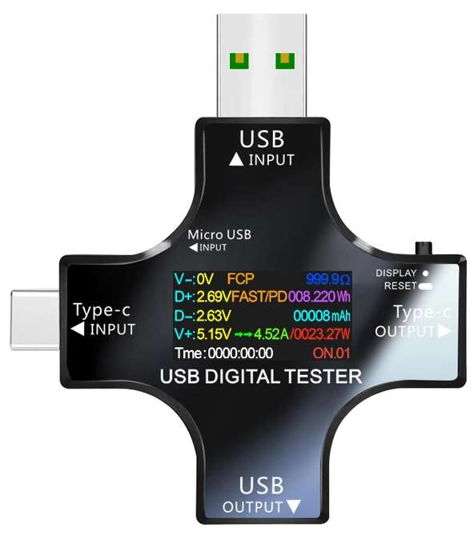

# USB Tester Dashboard
A web-based dashboard for monitoring USB power metrics in real-time via Bluetooth.  

**Directly use it here:** [https://hpirila.github.io/usb-tester](https://hpirila.github.io/usb-tester)

  

## Buy Device
[Aliexpress](https://s.click.aliexpress.com/e/_oF8CCmf)  

## Features
- **Real-time monitoring** of Voltage (V), Current (A), Power (W), Energy (Ah/Wh) and USB data lines (D+/D-).  
- **Bluetooth connectivity** for live data (Web Bluetooth API).  
- **Emulator mode** for testing without hardware.  
- **Export data** to CSV for analysis.  
## How to Use
1. **Connect your USB Tester device** via Bluetooth (Chrome/Edge recommended).  
2. **View live charts** for metrics like voltage, current, and power.  
3. **Save data** using the "Save to CSV" button.  
4. **No device?** Use the "Connect Emulator" option to simulate data.  
## Setup in local environment
1. Copy the content of this repository to your local location
2. Start web server in the same folder: `python.exe -m http.server`
3. Open the page in browser http://localhost:8000

Not all browsers support Bluetooth. Chrome and Edge requires the domain to be either localhost or use secure connection with https.
## Screenshots
### Drone battery charging

